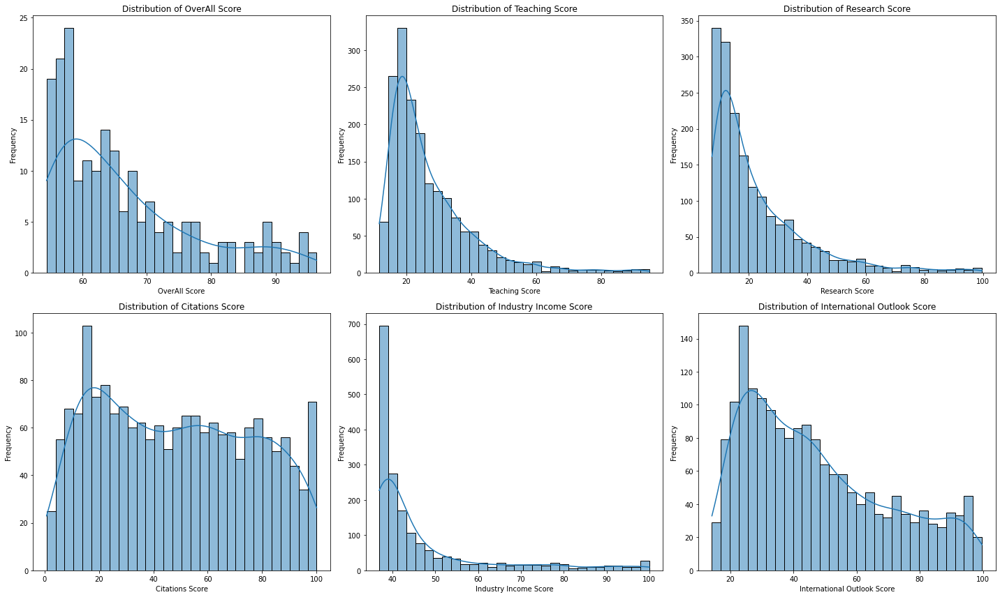

---

# 🌍 World University Rankings 2023
## Data Analysis and Visualization 📊

---

### 📌 Introduction:
Dive deep into the "World University Rankings 2023" dataset. It's a treasure trove of insights revealing the performance of universities on a global stage, spanning metrics from teaching prowess to research capabilities.

---

### 🔨 Data Cleaning:
Before the real action, we prepped our dataset:
1. **Numeric Makeover 🧮:** 
    - Fields like 'International Student', 'OverAll Score', and 'No of student' shed their textual skins to emerge as pure numbers. 
    - Stripped away pesky percentage signs and commas for a cleaner look!
2. **Dissecting Ratios 🔪:** 
    - Sliced and diced the 'Female:Male Ratio' to extract individual gender counts.
    - Birthed a numeric ratio for a more analytical touch.

---

### 🎨 Visualizations and Deep Dives:

1. **Scoreboard Histograms 📊:**
    - Painted the landscape of scores: "OverAll Score", "Teaching Score", "Research Score", "Citations Score", "Industry Income Score", and "International Outlook Score".

    **🔍 Insights:**
    - Score scarcity at the top! Few universities touch the zenith.
    - "Teaching", "Research", and "Citations" dance in harmony with the "OverAll Score".
    - The "Industry Income Score"? Well, it marches to its own beat.

2. **Country Count Barometer 🌏:**
    - Etched bars representing the top 30 countries, ranked by their university count.

    **🔍 Insights:**
    - USA stands tall, with the UK, India, and China trailing behind. A testament to their colossal educational infrastructures.

3. **Gender Balance Pie 🚻:**
    - A pie sliced to represent the gender equilibrium across universities.

    **🔍 Insights:**
    - The scales balance out at many universities. Gender equality is in sight!
    - The majority of universities have a balanced gender ratio (between 0.75-1 and 1-1.5), indicating roughly equal numbers of male and female students.
    - Yet, several universities tip towards female domination (ratios greater than 1).

4. **Score Correlation Heatmap 🔥:**
    - A warm heatmap radiating the intricate relationships between performance metrics.
    

    **🔍 Insights:**
    - "Teaching" and "Research"? They're best pals with "OverAll Score".
    - "Citations" and "Industry Income"? Let's just say they don't get along very well.
    - "Industry Income Score" is the rebel, choosing its own path.

---

### 💭 In Conclusion:
Embark on a journey with this analysis, and you'll uncover the hidden facets of university performance metrics. Whether you're a policymaker, university bigwig, or an educational enthusiast, there's something here for you. Dive in!

---
